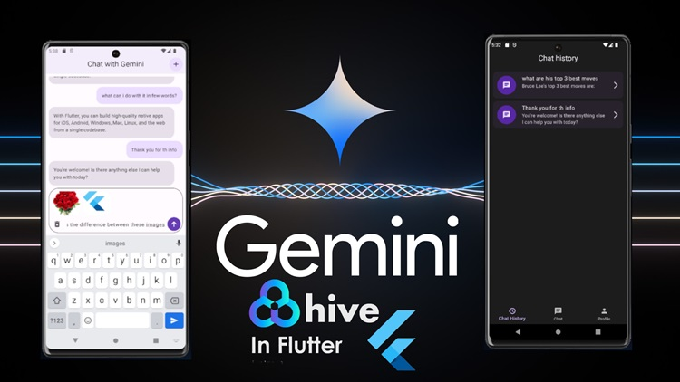

# flutter_gemini

Flutter, Google Gemini Chat Bot with Hive local storage.

## Getting Started

This project is a starting point for a Flutter application.

  

## Usage

1. Clone the repository

2. Go to google AI for Developers https://ai.google.dev/ and get your Api Key

3. Then navigate to lib/api/api_service.dart file and past your Api key

4. Happy Coding.

A few resources to get you started if this is your first Flutter project:

- [Lab: Write your first Flutter app](https://docs.flutter.dev/get-started/codelab)
- [Cookbook: Useful Flutter samples](https://docs.flutter.dev/cookbook)

For help getting started with Flutter development, view the
[online documentation](https://docs.flutter.dev/), which offers tutorials,
samples, guidance on mobile development, and a full API reference.
